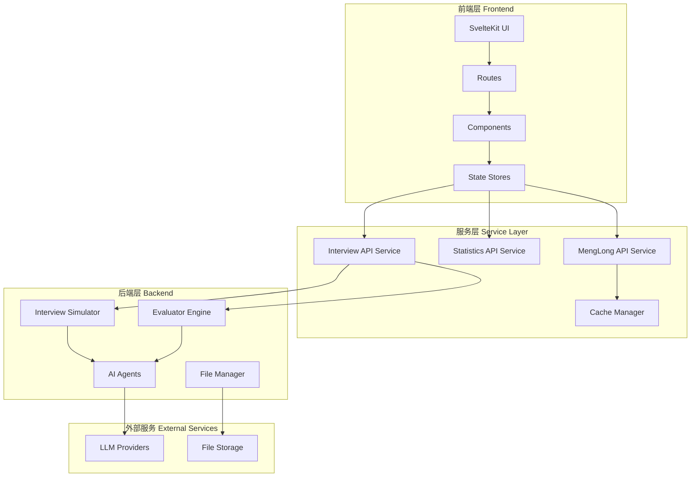
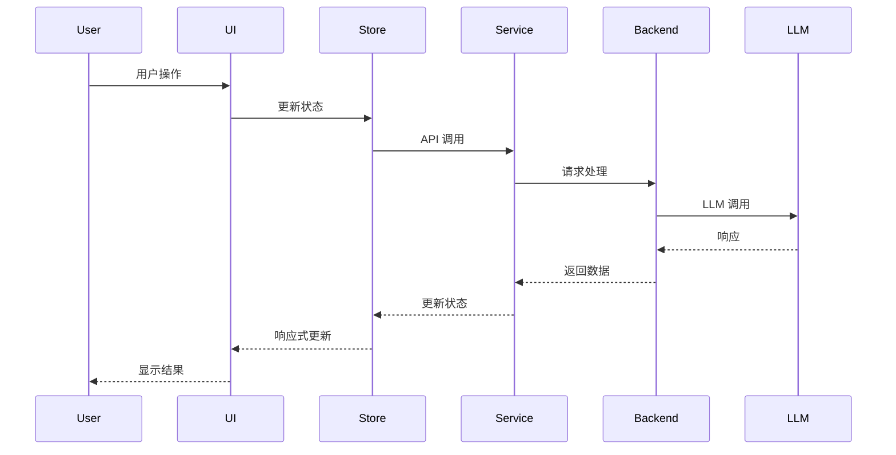
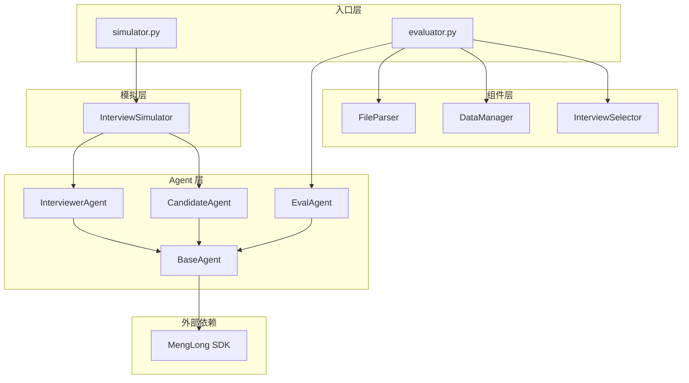
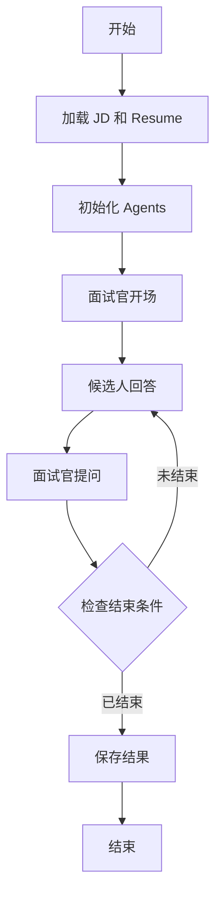
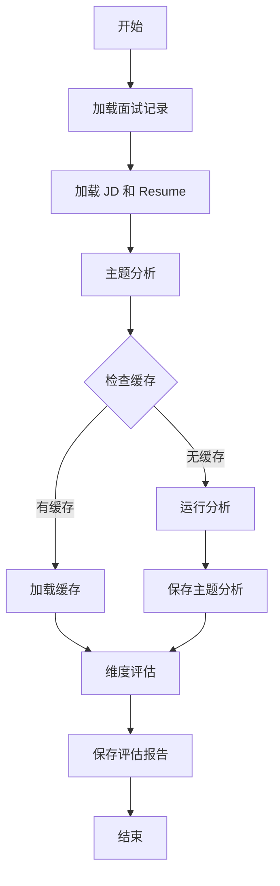

# AI Studio 开发文档

> **版本**: 1.0.0  
> **最后更新**: 2026-01-31  
> **维护者**: Development Team

## 📋 目录

1. [项目概览](#1-项目概览)
2. [技术架构](#2-技术架构)
3. [前端架构](#3-前端架构)
4. [后端架构](#4-后端架构)
5. [API 文档](#5-api-文档)
6. [核心模块详解](#6-核心模块详解)
7. [开发指南](#7-开发指南)
8. [部署指南](#8-部署指南)

---

## 1. 项目概览

### 1.1 项目简介

AI Studio 是一个现代化的 AI 模型管理和测试平台,提供以下核心功能:

- **统计仪表板** - 实时监控 API 调用、Token 使用量和费用统计
- **AI Playground** - 多模型测试和参数调节
- **面试模拟系统** - 基于 LLM 的智能面试模拟和评估

### 1.2 技术栈

| 层级 | 技术 | 版本 | 用途 |
|------|------|------|------|
| **前端框架** | SvelteKit | 5.x | 应用框架 |
| **开发语言** | TypeScript | 5.9+ | 类型安全 |
| **样式框架** | Tailwind CSS | 4.x | UI 样式 |
| **组件库** | Flowbite Svelte | 1.31+ | UI 组件 |
| **构建工具** | Vite | 7.x | 构建打包 |
| **包管理器** | pnpm | 8.0+ | 依赖管理 |
| **后端语言** | Python | 3.11+ | 面试系统 |
| **LLM SDK** | MengLong | latest | AI 模型调用 |

### 1.3 项目结构

```
ai-studio/
├── src/                          # 前端源代码
│   ├── lib/                      # 共享库
│   │   ├── components/           # UI 组件
│   │   ├── services/             # API 服务层
│   │   ├── stores/               # 状态管理
│   │   ├── types/                # TypeScript 类型
│   │   └── utils/                # 工具函数
│   └── routes/                   # 页面路由
│       ├── dashboard/            # 统计仪表板
│       ├── playground/           # AI Playground
│       └── interview-sim/        # 面试模拟
├── docs/                         # 文档
└── static/                       # 静态资源
```

---

## 2. 技术架构

### 2.1 整体架构图



### 2.2 数据流架构



---

## 3. 前端架构

### 3.1 目录结构详解

#### 3.1.1 `src/lib/` - 共享库

```
lib/
├── components/          # UI 组件
│   ├── charts/         # 图表组件
│   │   ├── AreaChart.svelte
│   │   ├── BarChart.svelte
│   │   ├── LineChart.svelte
│   │   └── PieChart.svelte
│   ├── dashboard/      # 仪表板组件
│   │   ├── APICallsOverview.svelte
│   │   ├── MetricGrid.svelte
│   │   ├── RealtimeMetrics.svelte
│   │   └── StatsCard.svelte
│   ├── interview/      # 面试组件
│   │   ├── ApiKeyConfig.svelte
│   │   ├── BatchProcessor.svelte
│   │   ├── EvaluatorInterface.svelte
│   │   ├── FileManager.svelte
│   │   ├── SimulatorInterface.svelte
│   │   └── TopicAnalysis.svelte
│   └── ui/            # 基础 UI 组件
│       ├── ApiKeyInput.svelte
│       ├── DateRangePicker.svelte
│       ├── Input.svelte
│       ├── LoadingSpinner.svelte
│       └── TimeRangeSelector.svelte
├── services/          # API 服务层
│   ├── api.ts                # 基础 API 客户端
│   ├── apiService.ts         # API 服务封装
│   ├── cache.ts              # 缓存管理
│   ├── menglongApi.ts        # MengLong API
│   ├── statisticsApi.ts      # 统计 API
│   └── interviewApi.ts       # 面试 API
├── stores/            # 状态管理
│   ├── api.ts                # API 状态
│   ├── playground.ts         # Playground 状态
│   ├── interview.ts          # 面试状态
│   └── theme.ts              # 主题状态
├── types/             # TypeScript 类型定义
│   ├── index.ts              # 主类型文件
│   └── pdfjs.d.ts            # PDF.js 类型
└── utils/             # 工具函数
    ├── constants.ts          # 常量定义
    ├── formatters.ts         # 格式化工具
    ├── timeFilters.ts        # 时间过滤
    └── validators.ts         # 验证工具
```

#### 3.1.2 `src/routes/` - 页面路由

```
routes/
├── +layout.svelte           # 全局布局
├── +page.svelte             # 首页
├── dashboard/               # 统计仪表板
│   └── +page.svelte
├── playground/              # AI Playground
│   └── +page.svelte
├── interview-sim/           # 面试模拟
│   └── +page.svelte
├── api-test/                # API 测试页面
│   └── +page.svelte
└── test/                    # 测试页面
    └── +page.svelte
```

### 3.2 核心服务层

#### 3.2.1 MengLong API 服务

**文件**: `src/lib/services/menglongApi.ts`

**职责**: 处理与 MengLong API 的所有交互

**核心类**: `MengLongAPIService`

**主要方法**:

```typescript
class MengLongAPIService {
  // 设置 API 密钥
  setApiKey(apiKey: string): void
  
  // 获取模型列表
  async getModels(): Promise<APIResponse<ModelInfo[]>>
  
  // 获取指定模型信息
  async getModel(modelId: string): Promise<APIResponse<ModelInfo>>
  
  // 发送聊天请求(非流式)
  async chat(request: ChatRequest): Promise<APIResponse<ChatResponse>>
  
  // 发送流式聊天请求
  async streamChat(
    request: ChatRequest,
    onChunk: (content: string) => void,
    onComplete?: (usage?: any) => void,
    onError?: (error: string) => void
  ): Promise<void>
  
  // 检查 API 连接状态
  async checkConnection(): Promise<APIResponse<any>>
}
```

**使用示例**:

```typescript
import { menglongApi } from '$lib/services/menglongApi';

// 设置 API Key
menglongApi.setApiKey('sk-your-api-key');

// 获取模型列表
const models = await menglongApi.getModels();

// 发送对话请求
const response = await menglongApi.chat({
  model: 'deepseek-chat',
  messages: [{ role: 'user', content: 'Hello' }],
  temperature: 0.7
});

// 流式对话
await menglongApi.streamChat(
  { model: 'deepseek-chat', messages: [...] },
  (chunk) => console.log(chunk),
  (usage) => console.log('Complete:', usage),
  (error) => console.error('Error:', error)
);
```

#### 3.2.2 Statistics API 服务

**文件**: `src/lib/services/statisticsApi.ts`

**职责**: 处理统计数据的获取和管理

**核心类**: `StatisticsApiClient`

**主要方法**:

```typescript
class StatisticsApiClient {
  // 设置 API Key
  setApiKey(apiKey: string): void
  
  // 检查管理员权限
  async checkAdminStatus(): Promise<boolean>
  
  // 获取我的统计数据
  async getMyStatistics(params?: StatisticsApiParams): Promise<APIResponse<UsageStatistics>>
  
  // 获取总体统计(仅管理员)
  async getOverviewStatistics(params?: StatisticsApiParams): Promise<APIResponse<UsageStatistics>>
  
  // 获取所有 Key 的统计列表(仅管理员)
  async getAllKeysStatistics(params?: StatisticsApiParams): Promise<APIResponse<KeyStatistics[]>>
  
  // 查询调用日志
  async getLogs(params?: LogsApiParams): Promise<APIResponse<LogsResponse>>
  
  // 健康检查
  async healthCheck(): Promise<APIResponse<{status: string; timestamp: string}>>
  
  // 导出统计数据
  async exportStatistics(format: 'csv' | 'json', params?: StatisticsApiParams): Promise<Blob>
  
  // 清理旧记录(仅管理员)
  async cleanupOldRecords(days: number): Promise<APIResponse<any>>
}
```

**类型定义**:

```typescript
interface UsageStatistics {
  total_calls: number;
  successful_calls: number;
  failed_calls: number;
  total_input_tokens: number;
  total_output_tokens: number;
  total_tokens: number;
  total_cost: number;
  stream_calls: number;
  non_stream_calls: number;
}

interface ApiCallLog {
  id: number;
  timestamp: string;
  api_key_name: string;
  endpoint: string;
  method: string;
  status_code: number | null;
  model_name: string | null;
  input_tokens: number;
  output_tokens: number;
  total_tokens: number;
  cost: number;
  latency_ms: number | null;
  error_message: string | null;
  is_stream: boolean;
}
```

#### 3.2.3 Interview API 服务

**文件**: `src/lib/services/interviewApi.ts`

**职责**: 处理面试模拟和评估功能

**核心类**: `InterviewApiService`

**主要方法**:

```typescript
class InterviewApiService {
  // 初始化服务
  async initialize(): Promise<void>
  
  // 开始面试模拟
  async startSimulation(config: InterviewConfig): Promise<APIResponse<InterviewSession>>
  
  // 开始评估分析
  async startEvaluation(config: EvaluatorConfig): Promise<APIResponse<AnalysisResult>>
  
  // 获取文件列表
  async getFiles(type?: 'jd' | 'resume' | 'conversation' | 'report'): Promise<APIResponse<UploadedFile[]>>
  
  // 上传文件
  async uploadFile(file: File, type: 'jd' | 'resume' | 'conversation'): Promise<APIResponse<UploadedFile>>
  
  // 获取面试历史
  async getInterviewHistory(): Promise<APIResponse<InterviewRecord[]>>
  
  // 删除文件
  async deleteFile(fileId: string): Promise<APIResponse<boolean>>
  
  // 获取文件内容
  async getFileContent(path: string): Promise<APIResponse<{content: string; type: string}>>
}
```

### 3.3 状态管理

#### 3.3.1 API 状态 (`stores/api.ts`)

管理 API 连接状态、密钥和请求状态:

```typescript
interface ApiState {
  apiKey: string | null;
  isConnected: boolean;
  isAdmin: boolean;
  lastError: string | null;
  requestsInProgress: number;
}
```

#### 3.3.2 Playground 状态 (`stores/playground.ts`)

管理 Playground 的模型选择、参数和对话历史:

```typescript
interface PlaygroundState {
  selectedModel: string | null;
  parameters: ModelParameters;
  messages: Message[];
  isStreaming: boolean;
  currentResponse: string;
  usage: Usage | null;
}
```

#### 3.3.3 面试状态 (`stores/interview.ts`)

管理面试模拟和评估的状态:

```typescript
interface InterviewState {
  currentSession: InterviewSession | null;
  uploadedFiles: UploadedFile[];
  analysisResults: AnalysisResult[];
  isProcessing: boolean;
}
```

#### 3.3.4 主题状态 (`stores/theme.ts`)

管理应用主题(明暗模式):

```typescript
interface ThemeState {
  theme: Theme; // 'light' | 'dark' | 'system'
  resolvedTheme: ResolvedTheme; // 'light' | 'dark'
}
```

### 3.4 TypeScript 类型系统

**文件**: `src/lib/types/index.ts`

#### 核心类型分类

1. **API 相关类型**
   - `APIResponse<T>` - 统一的 API 响应格式
   - `APIError` - 错误类型
   - `APIClientConfig` - API 客户端配置

2. **MengLong API 类型**
   - `Message` - 消息格式
   - `ChatRequest` - 聊天请求
   - `ChatResponse` - 聊天响应
   - `StreamResponse` - 流式响应
   - `ModelInfo` - 模型信息
   - `Usage` - Token 使用量

3. **统计相关类型**
   - `UsageStatistics` - 使用统计
   - `ApiCallLog` - API 调用日志
   - `KeyStatistics` - Key 统计

4. **面试相关类型**
   - `InterviewConfig` - 面试配置
   - `InterviewSession` - 面试会话
   - `InterviewMessage` - 面试消息
   - `TopicAnalysisResult` - 主题分析结果
   - `EvaluationResult` - 评估结果
   - `DimensionScore` - 维度评分

5. **UI 组件类型**
   - `LoadingState` - 加载状态
   - `AsyncState<T>` - 异步状态
   - `NavItem` - 导航项

---

## 4. 后端架构

### 4.1 Interview-Sim 系统

**目录**: `interview-sim/`

#### 4.1.1 整体架构



### 4.2 核心模块详解

#### 4.2.1 Agent 系统

##### BaseAgent (基础代理)

**文件**: `agents/base_agent.py`

**职责**: 所有 AI 代理的基类,提供与 LLM 交互的基础功能

**核心方法**:

```python
class BaseAgent:
    def __init__(self, name: str, role: str, model: str):
        """
        初始化代理
        
        Args:
            name: 代理名称
            role: 代理角色
            model: 使用的模型 ID
        """
        self.name = name
        self.role = role
        self.model = model
        self.client = Model(default_model_id=model)
    
    def generate_response(
        self, 
        messages: List[Dict[str, str]], 
        system_prompt: str = "", 
        thinking: bool = False
    ) -> str:
        """
        生成响应
        
        Args:
            messages: 对话历史 [{"role": "user/assistant", "content": "..."}]
            system_prompt: 系统提示词
            thinking: 是否启用思考模式
            
        Returns:
            生成的响应文本,如果 thinking=True 则返回 (思考, 响应) 元组
        """
        # 使用 MengLong SDK 的 stream_chat
        # 支持流式输出和思考过程展示
        ...
    
    def run(self, *args, **kwargs):
        """子类必须实现的运行方法"""
        raise NotImplementedError
```

**关键特性**:
- 使用 MengLong SDK 进行 LLM 调用
- 支持流式输出
- 支持思考(reasoning)模式
- 统一的消息格式处理

##### InterviewerAgent (面试官代理)

**文件**: `agents/interviewer_agent.py`

**职责**: 模拟面试官,根据 JD 和简历提问

**核心功能**:
- 基于职位描述(JD)和候选人简历生成问题
- 可选参考真实面试记录(transcript)进行引导
- 判断面试是否结束
- 维护面试上下文

**系统提示词结构**:
```
角色定位: 专业面试官
任务: 根据 JD 评估候选人
要求:
  - 提问有针对性
  - 深入挖掘经验
  - 判断结束时机
输出格式: 纯文本问题
```

##### CandidateAgent (候选人代理)

**文件**: `agents/candidate_agent.py`

**职责**: 模拟候选人,根据简历回答问题

**核心功能**:
- 基于简历内容回答问题
- 保持角色一致性
- 自然的对话风格

##### EvalAgent (评估代理)

**文件**: `agents/eval_agent.py`

**职责**: 评估面试表现

**核心功能**:
1. **主题拆解** - 将面试对话拆分为主题
2. **多维度评估** - 按照六个维度评分:
   - 聪明度
   - 勤奋度
   - 目标感
   - 皮实度
   - 迎难而上
   - 客户第一

**评估流程**:
```python
# 1. 主题分析
topic_analysis = eval_agent.analyze_topics(transcript, jd, resume)

# 2. 维度评估
evaluation = eval_agent.evaluate(topic_analysis, transcript, jd, resume)
```

#### 4.2.2 模拟器系统

##### InterviewSimulator (面试模拟器)

**文件**: `simulation/interview_simulator.py`

**职责**: 协调面试官和候选人进行对话

**核心流程**:

```python
class InterviewSimulator:
    def __init__(
        self, 
        jd: str, 
        resume: str, 
        transcript: Optional[str] = None,
        interviewer_model: str = "...",
        candidate_model: str = "..."
    ):
        """
        初始化模拟器
        
        Args:
            jd: 职位描述
            resume: 候选人简历
            transcript: 可选的参考面试记录
            interviewer_model: 面试官使用的模型
            candidate_model: 候选人使用的模型
        """
        self.interviewer = InterviewerAgent(jd, resume, transcript, interviewer_model)
        self.candidate = CandidateAgent(resume, candidate_model)
        self.conversation = []
        self.metadata = {}
    
    def run(self, max_turns: int = 20, verbose: bool = True) -> Dict[str, Any]:
        """
        执行模拟面试
        
        Args:
            max_turns: 最大对话轮数
            verbose: 是否打印过程
            
        Returns:
            包含完整对话记录和元数据的字典
        """
        # 1. 面试官开场
        # 2. 循环对话
        #    - 候选人回答
        #    - 面试官提问
        #    - 检查结束条件
        # 3. 返回结果
        ...
    
    def save(self, output_dir: str, name: str, jd_name: str):
        """
        保存模拟结果
        
        输出格式:
        - Markdown: 可视化友好
        - JSON: 结构化数据
        - TXT: 纯文本格式
        """
        ...
```

**对话流程**:

```mermaid
sequenceDiagram
    participant Sim as Simulator
    participant Int as Interviewer
    participant Can as Candidate
    
    Sim->>Int: 开始面试
    Int->>Sim: 开场白
    
    loop 对话循环 (max_turns)
        Sim->>Can: 传递问题
        Can->>Sim: 回答
        Sim->>Int: 传递回答
        Int->>Sim: 下一个问题
        
        alt 面试官判断结束
            Int->>Sim: 结束信号
            break
        end
    end
    
    Sim->>Sim: 保存记录
```

#### 4.2.3 评估器系统

##### Evaluator (评估器)

**文件**: `evaluator.py`

**职责**: 评估面试表现的主入口

**核心流程**:

```python
def process_interview(transcript_name, args, data_manager, path_override=None):
    """
    处理单个面试评估
    
    流程:
    1. 加载数据 (transcript, JD, resume)
    2. 运行主题分析
    3. 运行维度评估
    4. 保存结果
    
    Args:
        transcript_name: 面试记录名称
        args: 命令行参数
        data_manager: 数据管理器
        path_override: 路径覆盖(用于批处理)
    """
    # 1. 加载面试记录
    transcript_content = load_transcript(transcript_name)
    
    # 2. 自动推断 JD 和 Resume
    # 命名规范: name_desc_transcript_x
    # JD: desc_jd
    # Resume: name_resume
    
    # 3. 运行主题分析
    topic_analysis = run_topic_analysis(...)
    
    # 4. 运行评估
    evaluation = run_evaluation(...)
    
    # 5. 保存结果
    data_manager.save_report(...)
```

**支持的功能**:
- 交互式选择面试记录
- 批量处理
- 条件过滤(按 JD、候选人)
- 仅主题分析模式
- 临时模式(不覆盖正式报告)
- 强制重新生成

#### 4.2.4 组件层

##### FileParser (文件解析器)

**文件**: `components/file_parser.py`

**职责**: 解析各种格式的文件

**支持格式**:
- PDF (使用 MengLong SDK 的 PDF 解析)
- TXT
- Markdown
- JSON

**核心方法**:

```python
class FileParser:
    @staticmethod
    def parse_pdf(file_path: str) -> str:
        """解析 PDF 文件,返回文本内容"""
        ...
    
    @staticmethod
    def parse_text(file_path: str) -> str:
        """解析文本文件"""
        ...
    
    @staticmethod
    def parse_json(file_path: str) -> Dict:
        """解析 JSON 文件"""
        ...
```

##### DataManager (数据管理器)

**文件**: `components/data_manager.py`

**职责**: 管理数据的读取和保存

**核心功能**:
- 文件路径管理
- 缓存管理
- 报告保存
- 数据版本控制

##### InterviewSelector (面试选择器)

**文件**: `components/selector.py`

**职责**: 提供交互式和批量选择面试记录的功能

**核心功能**:
- 交互式选择
- 多选支持
- 条件过滤
- 批量操作

### 4.3 数据流

#### 4.3.1 面试模拟流程



#### 4.3.2 评估流程



---

## 5. API 文档

### 5.1 MengLong API

**Base URL**: `http://localhost:8000/menglong`

#### 5.1.1 获取模型列表

```http
GET /menglong/models
Headers:
  X-API-Key: <your-api-key>
```

**响应**:
```json
{
  "data": [
    {
      "id": "deepseek-chat",
      "name": "DeepSeek Chat",
      "provider": "deepseek",
      "description": "DeepSeek 对话模型",
      "max_tokens": 4096,
      "supports": {
        "streaming": true,
        "image": false,
        "audio": false,
        "file": false
      },
      "price": {
        "input": 0.0001,
        "cache_input": 0.00005,
        "output": 0.0002
      }
    }
  ],
  "success": true,
  "timestamp": "2026-01-31T12:00:00Z"
}
```

#### 5.1.2 聊天接口

```http
POST /menglong/chat
Headers:
  X-API-Key: <your-api-key>
  Content-Type: application/json

Body:
{
  "model": "deepseek-chat",
  "messages": [
    {"role": "user", "content": "Hello"}
  ],
  "temperature": 0.7,
  "max_tokens": 1000,
  "stream": false
}
```

**响应(非流式)**:
```json
{
  "data": {
    "id": "chatcmpl-xxx",
    "model": "deepseek-chat",
    "created": 1706745600,
    "output": {
      "role": "assistant",
      "content": "Hello! How can I help you?"
    },
    "usage": {
      "input_tokens": 10,
      "output_tokens": 8,
      "total_tokens": 18
    },
    "finish_reason": "stop"
  },
  "success": true,
  "timestamp": "2026-01-31T12:00:00Z"
}
```

**响应(流式)**:
```
{"id":"chatcmpl-xxx","model":"deepseek-chat","created":1706745600,"delta":{"content":"Hello"},"finish_reason":null}
{"id":"chatcmpl-xxx","model":"deepseek-chat","created":1706745600,"delta":{"content":"!"},"finish_reason":null}
{"id":"chatcmpl-xxx","model":"deepseek-chat","created":1706745600,"delta":{"content":" How"},"finish_reason":null}
...
{"id":"chatcmpl-xxx","model":"deepseek-chat","created":1706745600,"delta":{"content":""},"finish_reason":"stop","usage":{"input_tokens":10,"output_tokens":8,"total_tokens":18}}
```

### 5.2 Statistics API

**Base URL**: `http://localhost:8000/statistics`

#### 5.2.1 获取我的统计

```http
GET /statistics/my?start_date=2026-01-01&end_date=2026-01-31
Headers:
  X-API-Key: <your-api-key>
```

**响应**:
```json
{
  "data": {
    "total_calls": 1250,
    "successful_calls": 1200,
    "failed_calls": 50,
    "total_input_tokens": 50000,
    "total_output_tokens": 75000,
    "total_tokens": 125000,
    "total_cost": 12.50,
    "stream_calls": 800,
    "non_stream_calls": 450
  },
  "success": true,
  "timestamp": "2026-01-31T12:00:00Z"
}
```

#### 5.2.2 获取总体统计(管理员)

```http
GET /statistics/overview?start_date=2026-01-01&end_date=2026-01-31
Headers:
  X-API-Key: <admin-api-key>
```

#### 5.2.3 获取调用日志

```http
GET /statistics/logs?page=1&page_size=50&model_name=deepseek-chat
Headers:
  X-API-Key: <your-api-key>
```

**响应**:
```json
{
  "data": {
    "logs": [
      {
        "id": 1,
        "timestamp": "2026-01-31T12:00:00Z",
        "api_key_name": "my-key",
        "endpoint": "/menglong/chat",
        "method": "POST",
        "status_code": 200,
        "model_name": "deepseek-chat",
        "input_tokens": 100,
        "output_tokens": 150,
        "total_tokens": 250,
        "cost": 0.05,
        "latency_ms": 1500,
        "error_message": null,
        "is_stream": true
      }
    ],
    "total": 1250,
    "page": 1,
    "page_size": 50,
    "total_pages": 25
  },
  "success": true,
  "timestamp": "2026-01-31T12:00:00Z"
}
```

---

## 6. 核心模块详解

### 6.1 缓存系统

**文件**: `src/lib/services/cache.ts`

**职责**: 提供智能缓存管理,减少不必要的 API 调用

**核心功能**:

```typescript
class CacheManager {
  // 设置缓存
  set<T>(key: string, value: T, ttl?: number): void
  
  // 获取缓存
  get<T>(key: string): T | null
  
  // 删除缓存
  delete(key: string): void
  
  // 清空缓存
  clear(): void
  
  // 检查缓存是否存在
  has(key: string): boolean
}
```

**缓存策略**:
- 模型列表: 缓存 1 小时
- 统计数据: 缓存 30 秒
- 文件内容: 缓存 5 分钟

### 6.2 错误处理

**文件**: `src/lib/services/api.ts`

**统一错误处理机制**:

```typescript
enum ErrorType {
  NETWORK_ERROR = 'network_error',
  API_ERROR = 'api_error',
  VALIDATION_ERROR = 'validation_error',
  AUTHENTICATION_ERROR = 'auth_error',
  TIMEOUT_ERROR = 'timeout_error',
  UNKNOWN_ERROR = 'unknown_error'
}

interface ErrorHandlingStrategy {
  type: ErrorType;
  retryable: boolean;
  maxRetries: number;
  retryDelay: number;
  userMessage: string;
  logLevel: 'info' | 'warn' | 'error';
}
```

**重试策略**:
- 网络错误: 最多重试 3 次,延迟 1 秒
- API 错误: 不重试
- 超时错误: 最多重试 2 次,延迟 2 秒

### 6.3 工具函数

#### 6.3.1 格式化工具 (`utils/formatters.ts`)

```typescript
// 格式化数字
export function formatNumber(num: number): string

// 格式化货币
export function formatCurrency(amount: number, currency: string = 'USD'): string

// 格式化日期
export function formatDate(date: Date, format: string): string

// 格式化文件大小
export function formatFileSize(bytes: number): string

// 格式化 Token 数量
export function formatTokens(tokens: number): string
```

#### 6.3.2 验证工具 (`utils/validators.ts`)

```typescript
// 验证 API Key 格式
export function validateApiKey(key: string): boolean

// 验证模型 ID
export function validateModelId(modelId: string): boolean

// 验证参数范围
export function validateParameter(value: number, min: number, max: number): boolean
```

#### 6.3.3 时间过滤 (`utils/timeFilters.ts`)

```typescript
// 获取时间范围
export function getTimeRange(range: 'today' | 'week' | 'month' | 'custom'): {
  start_date: string;
  end_date: string;
}

// 格式化时间戳
export function formatTimestamp(timestamp: number): string
```

---

## 7. 开发指南

### 7.1 环境搭建

#### 7.1.1 前端环境

```bash
# 1. 安装 Node.js 18+
# 2. 安装 pnpm
npm install -g pnpm

# 3. 克隆项目
git clone <repository-url>
cd ai-studio

# 4. 安装依赖
pnpm install

# 5. 启动开发服务器
pnpm dev
```

#### 7.1.2 后端环境

```bash
# 1. 安装 Python 3.11+
# 2. 安装 uv
pip install uv

# 3. 进入 interview-sim 目录
cd interview-sim

# 4. 安装依赖
uv sync

# 5. 配置 MengLong SDK
# 创建 .configs.toml 文件
cat > .configs.toml << EOF
[default]
model_id = "anthropic/global.anthropic.claude-sonnet-4-5-20250929-v1:0"

[providers.menglong]
base_url = "YOUR_BASE_URL"
api_key = "YOUR_API_KEY"
EOF
```

### 7.2 开发规范

#### 7.2.1 代码风格

**TypeScript/JavaScript**:
- 使用 ESLint 和 Prettier
- 遵循 Airbnb 风格指南
- 使用 TypeScript 严格模式

**Python**:
- 遵循 PEP 8
- 使用类型提示
- 文档字符串使用 Google 风格

#### 7.2.2 命名规范

**文件命名**:
- 组件: `PascalCase.svelte`
- 服务: `camelCase.ts`
- 工具: `camelCase.ts`
- Python: `snake_case.py`

**变量命名**:
- 常量: `UPPER_SNAKE_CASE`
- 变量: `camelCase` (TS) / `snake_case` (Python)
- 类: `PascalCase`
- 函数: `camelCase` (TS) / `snake_case` (Python)

#### 7.2.3 Git 提交规范

使用 Conventional Commits:

```
<type>(<scope>): <subject>

<body>

<footer>
```

**Type**:
- `feat`: 新功能
- `fix`: 修复 bug
- `docs`: 文档更新
- `style`: 代码格式
- `refactor`: 重构
- `test`: 测试
- `chore`: 构建/工具

**示例**:
```
feat(playground): add streaming support

- Implement streaming chat interface
- Add progress indicators
- Handle stream errors

Closes #123
```

### 7.3 测试指南

#### 7.3.1 前端测试

```bash
# 运行测试
pnpm test

# 监听模式
pnpm test:watch

# 类型检查
pnpm check
```

#### 7.3.2 后端测试

```bash
# 运行模拟器测试
uv run simulator.py --jd test_jd --resume test_resume --temp

# 运行评估器测试
uv run evaluator.py --name test_transcript --temp
```

### 7.4 调试技巧

#### 7.4.1 前端调试

**浏览器 DevTools**:
- 使用 Svelte DevTools 扩展
- 查看 Network 标签页监控 API 调用
- 使用 Console 查看日志

**日志级别**:
```typescript
// 开发环境启用详细日志
if (import.meta.env.DEV) {
  console.log('[DEBUG]', data);
}
```

#### 7.4.2 后端调试

**Python 调试**:
```python
# 使用 rich 库进行美化输出
from rich import print
print("[bold green]Debug info:[/bold green]", data)

# 使用 pdb 调试
import pdb; pdb.set_trace()
```

### 7.5 性能优化

#### 7.5.1 前端优化

1. **代码分割**
   - 使用 SvelteKit 的自动代码分割
   - 懒加载大型组件

2. **缓存策略**
   - 使用 CacheManager 缓存 API 响应
   - 实现本地存储持久化

3. **图片优化**
   - 使用 WebP 格式
   - 实现懒加载

#### 7.5.2 后端优化

1. **批处理**
   - 使用批量评估模式
   - 并行处理多个面试

2. **缓存**
   - 缓存主题分析结果
   - 避免重复调用 LLM

---

## 8. 部署指南

### 8.1 前端部署

#### 8.1.1 构建生产版本

```bash
# 构建
pnpm build

# 预览
pnpm preview
```

#### 8.1.2 Docker 部署

```dockerfile
FROM node:18-alpine AS builder
WORKDIR /app
COPY package.json pnpm-lock.yaml ./
RUN npm install -g pnpm && pnpm install
COPY . .
RUN pnpm build

FROM node:18-alpine
WORKDIR /app
COPY --from=builder /app/build ./build
COPY --from=builder /app/package.json ./
RUN npm install -g pnpm && pnpm install --prod
EXPOSE 3000
CMD ["node", "build"]
```

#### 8.1.3 静态部署

```bash
# 使用 adapter-static
npm install -D @sveltejs/adapter-static

# 修改 svelte.config.js
import adapter from '@sveltejs/adapter-static';

# 构建
pnpm build

# 部署 build/ 目录到 CDN 或静态服务器
```

### 8.2 后端部署

#### 8.2.1 生产环境配置

```toml
# .configs.toml
[default]
model_id = "anthropic/global.anthropic.claude-sonnet-4-5-20250929-v1:0"

[providers.menglong]
base_url = "https://api.production.com"
api_key = "prod-api-key"

[providers.anthropic]
api_key = "anthropic-api-key"
```

#### 8.2.2 Docker 部署

```dockerfile
FROM python:3.11-slim
WORKDIR /app
COPY interview-sim/ ./
RUN pip install uv && uv sync
CMD ["uv", "run", "simulator.py"]
```

### 8.3 环境变量

**前端**:
```env
VITE_API_BASE_URL=https://api.production.com
VITE_DEFAULT_THEME=system
```

**后端**:
```env
MENGLONG_BASE_URL=https://api.menglong.com
MENGLONG_API_KEY=your-api-key
DATA_DIR=/app/data
```

### 8.4 监控和日志

#### 8.4.1 前端监控

- 使用 Sentry 进行错误追踪
- 使用 Google Analytics 进行用户行为分析
- 实现自定义性能监控

#### 8.4.2 后端监控

- 记录所有 LLM 调用
- 监控评估耗时
- 追踪错误率

---

## 附录

### A. 常见问题

**Q: 如何添加新的 LLM 模型?**

A: 在 MengLong SDK 配置中添加新的 provider,然后在前端模型列表中添加对应的模型信息。

**Q: 如何自定义评估维度?**

A: 修改 `agents/eval_agent.py` 中的评估提示词和维度定义。

**Q: 如何优化面试模拟的质量?**

A: 调整 Agent 的系统提示词,使用更强大的模型,提供更详细的 JD 和简历。

### B. 参考资源

- [SvelteKit 文档](https://kit.svelte.dev/docs)
- [Flowbite Svelte 文档](https://flowbite-svelte.com/)
- [Tailwind CSS 文档](https://tailwindcss.com/docs)
- [MengLong SDK 文档](https://github.com/gcyyfun/menglong)
- [TypeScript 文档](https://www.typescriptlang.org/docs/)

### C. 更新日志

**v1.0.0** (2026-01-31)
- 初始版本发布
- 完整的开发文档
- 前后端架构说明
- API 文档和开发指南

---

**文档维护**: 请在每次重大更新后更新此文档,保持文档与代码同步。
